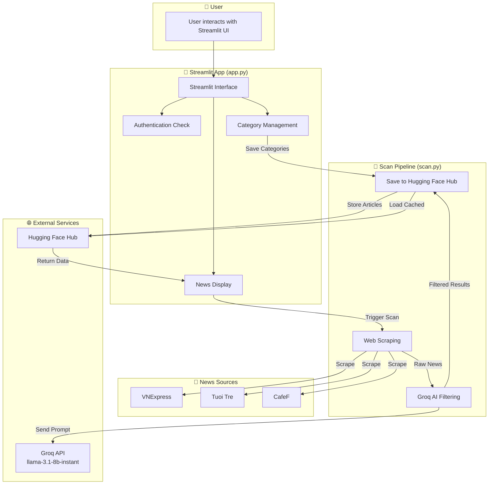
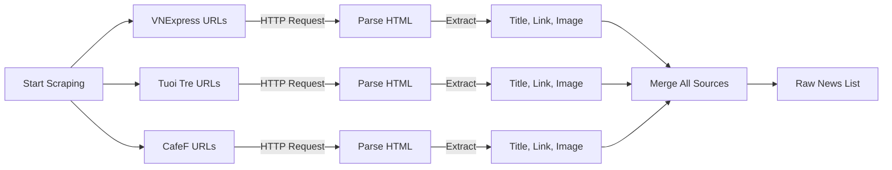
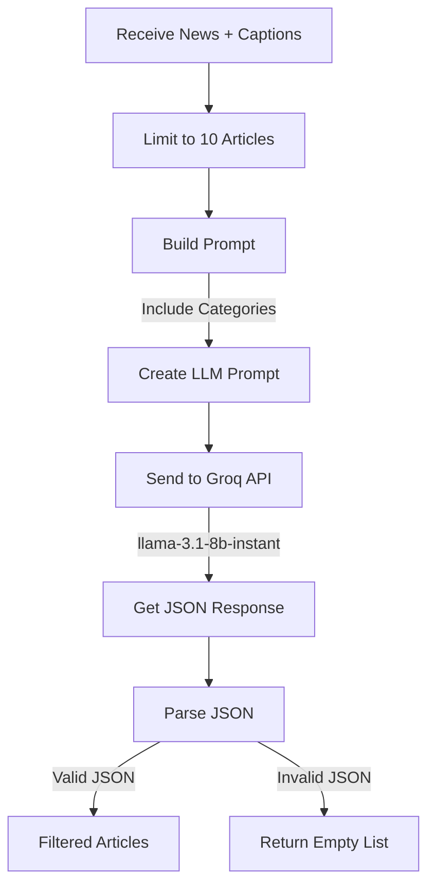
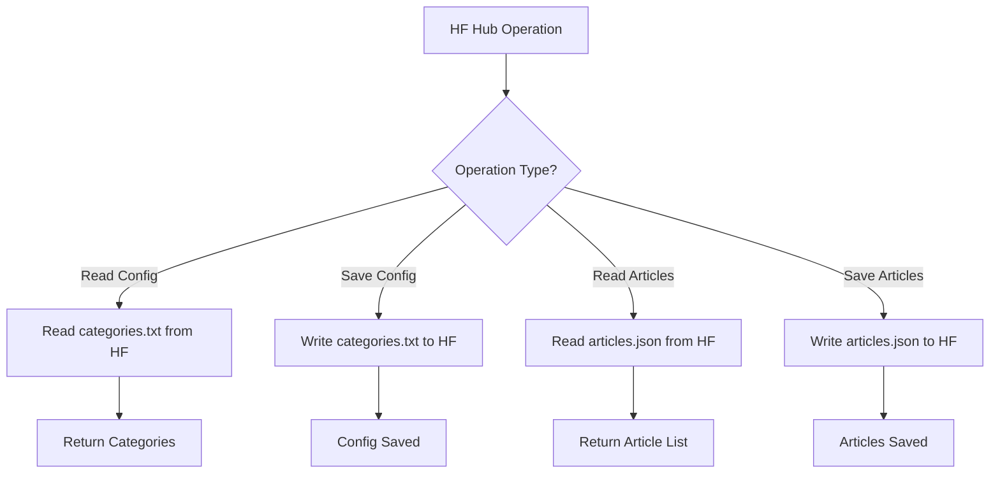
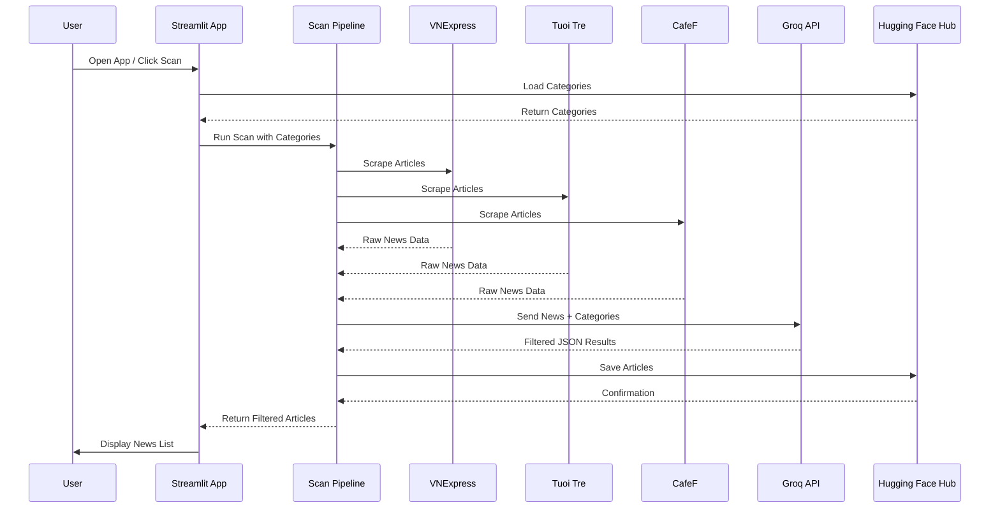
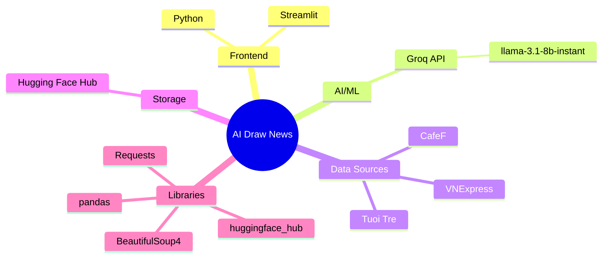

# AI Draw News - System Architecture

## System Overview Diagram



## Detailed Component Flow

### 1. Web Scraping Flow



### 2. AI Filtering Flow (Groq)



### 3. Hugging Face Hub Integration Flow



## Complete Data Flow



## Technology Stack



## File Structure

```
ai-draw-news/
├── app.py                 # Streamlit UI application
├── scan.py                # Core scanning pipeline
├── run_scan.py           # CLI entry point
├── requirements.txt       # Python dependencies
├── README.md             # Documentation
├── .streamlit/
│   └── secrets.toml      # API keys & config
└── ARCHITECTURE.md       # This file
```

## API Integration Points

| Service | Purpose | Free Tier | Model Used |
|---------|---------|-----------|------------|
| Groq | Text analysis & filtering | 1000 req/day | llama-3.1-8b-instant |
| Hugging Face Hub | Data storage | Free for public/private repos | N/A |

## Key Features

1. **Multi-source Scraping** - Aggregates news from VNExpress, Tuoi Tre, and CafeF
2. **AI-powered Filtering** - Uses Groq LLM to identify relevant articles
3. **Persistent Storage** - Hugging Face Hub for articles and configuration
4. **Interactive UI** - Streamlit for easy user interaction